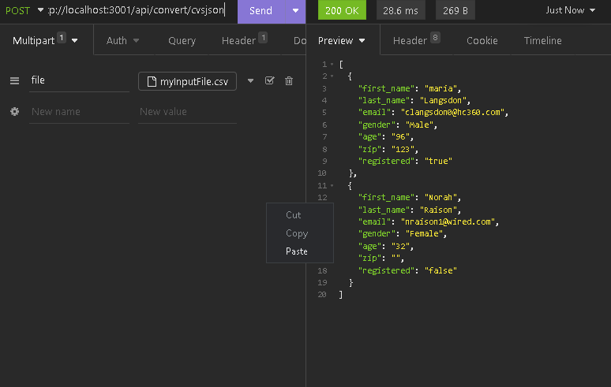
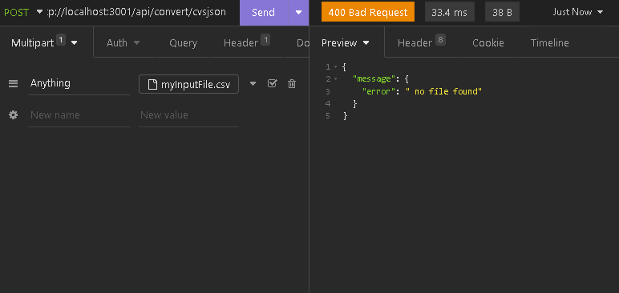

# CVS JSON CONVERT


a res api service with which you can convert csv files to json
With this link you can access the deployed project, keep in mind that it only has the post service to convert your csv files
[https://csv-to-json-convert-7stt.vercel.app/api/convert/csvjson](https://csv-to-json-convert-7stt.vercel.app/api/convert/csvjson)


## Install

```shell
  # clone this repository
    git clone https://github.com/Carlos-Carsdfj/

```

necessary to have installed **Nodejs** y **NPM** for the next steps

```shell
  # installed necesary dependency
  npm install
```

```shell
  # run the server
  npm run dev

```

visit the port [http://localhost:3001](http://localhost:3001) (client side)

## API REST

|         description         | method |          route           |    Content-Type     | name of file |
| :-------------------------: | :----: | :----------------------: | :-----------------: | :----------: |
| cvs to json convert service |  POST  | root/api/convert/cvsjson | multipart/form-data |     file     |

## TEST WITH INSOMNIA

### ALL OK



### INVALIDED FILE NAME OR FORMAT


